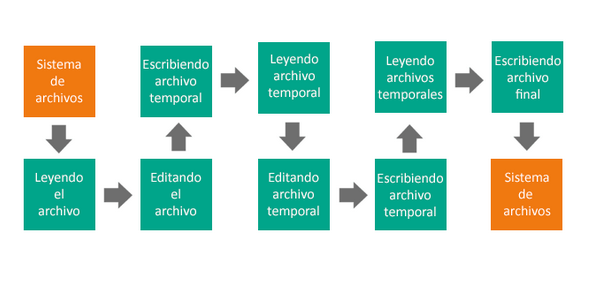
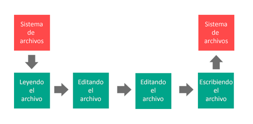
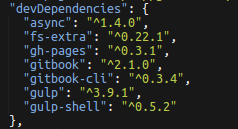

Gulp.js
-------------

Herramienta que automatiza y mejora nuestro flujo de trabajo. Su función principal reside en la automatización
de tareas comunes de desarrollo, agilizando el tiempo por tanto el tiempo empleado por el desarrollador en realizar
tareas comunes manualmente.

Está construido con Javascript, funcionando sobre Node.js
Además, es de Open Source, de modo que su código fuente es accesible desde github a partir de este [enlace](https://github.com/gulpjs/gulp/).

>- #### primary::Ventajas

>- Fácil de usar:  Tareas complejas que se convierten en otras más manejables. 

>- Eficiente: Construcciones más rápidas, sin necesidad de escribir archivos intermedios en el disco.
En definitiva, comparandolo con [Grunt.js](http://gruntjs.com/), realizará las mismas operaciones pero en menos tiempo y
sin necesidad de escribir en disco.

>- Alta calidad: Política de desarrollo basada en plugins simples de fácil uso para el usuario.

>- Fácil de aprender: Posibilidad de acces a múltiples prácticas de Node que combinadas con un mantenimiento mínimo de la API facilita que la labor de construcción 
de nuestra app sea más sencilla.
  

<hr />

>- #### primary::Grunt.js vs Gulp.js
> Grunt.s 
>      

> Gulp.js 
>      


<hr />

>- #### primary::Funcionamiento de Gulp.js

> 1.- Instalación de Gulp.js
>
```html
        $ npm install gulp --save-dev
```


> *Nota:*

>   Podemos verificar que gulp se ha instalado 
>  correctamente ejecutando el siguiente comando:
>
```
$ gulp -v
```

> 2.- Creamos en nuestro proyecto el fichero [gulpfile.js](gulpfile.md).

> 3.- Instalamos y agregamos nuevas dependencias como, por ejemplo: gulp-concat, gulp-shell, gulp-uglify, ...
Podemos encontrar una lista de plugins de gulp haciendo click [aqui](http://gulpjs.com/plugins/)

> 4.- Configuramos cada tarea(task) que se desea automatizar, siguiendo
el esquema:
```js
/*
* Configuración de una tarea
*/
gulp.task('nombre_tarea', function () {
  // Contenido de la tarea 'demo'
});
```
> 5.- Llamamos a la tarea previamente configurada desde consola
```bash
$ gulp "nombre_tarea"
```

<hr />

>- #### primary::Enlaces e interés

> 1.- [Ejemplo sencillo de creación de gulpfile](https://frontendlabs.io/1669--gulp-js-en-espanol-tutorial-basico-primeros-pasos-y-ejemplos)  

> 2.- [Repositorio en Github de gulpjs](https://github.com/gulpjs/gulp/)  

> 3.- [Gulpjs en wikipedia](https://en.wikipedia.org/wiki/Gulp.js)

<hr />

>- #### primary::Videotutoriales explicativo sobre el uso de Gulp.js (instalación, plugins, ...)

> https://www.youtube.com/watch?v=wNlEK8qrb0M&index=1&list=PLLnpHn493BHE2RsdyUNpbiVn-cfuV7Fos
